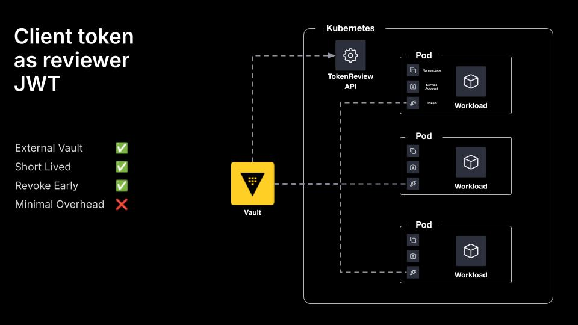

## Client Token as Reviewer JWT

When configuring Kubernetes auth, you can omit the `token_reviewer_jwt`, and Vault will use the Vault client's JWT as its own auth token when communicating with the Kubernetes TokenReview API.

This means Vault does not store any JWTs and allows you to use short-lived tokens everywhere but adds some operational overhead to maintain the cluster role bindings on the set of service accounts you want to be able to authenticate with Vault. Each client of Vault would need the `system:auth-delegator` ClusterRole.

> **Note:**  
> When using the Client JWT option, the token audience MUST be the Kubernetes Issuer URL.  
> You can use obtain the Issuer URL with the following command:  
> `kubectl get --raw /.well-known/openid-configuration | jq -r .issuer`

## Diagram


## Demo
Everything in this demo is done locally, so there are a few requirements you need to have installed on your machine:
- [Terraform](https://www.terraform.io/downloads.html)
- [Docker](https://www.docker.com/get-started)
- [Kind](https://kind.sigs.k8s.io/docs/user/quick-start#installation)
- [Kubectl](https://kubernetes.io/docs/tasks/tools/)

### Usage
```shell
$ terraform apply

$ docker ps
$ kubectl get namespaces
$ kubectl get -n workloads pods
$ kubectl logs -n workloads app

$ terraform destroy
```

## Documentation
- https://developer.hashicorp.com/vault/docs/auth/kubernetes
