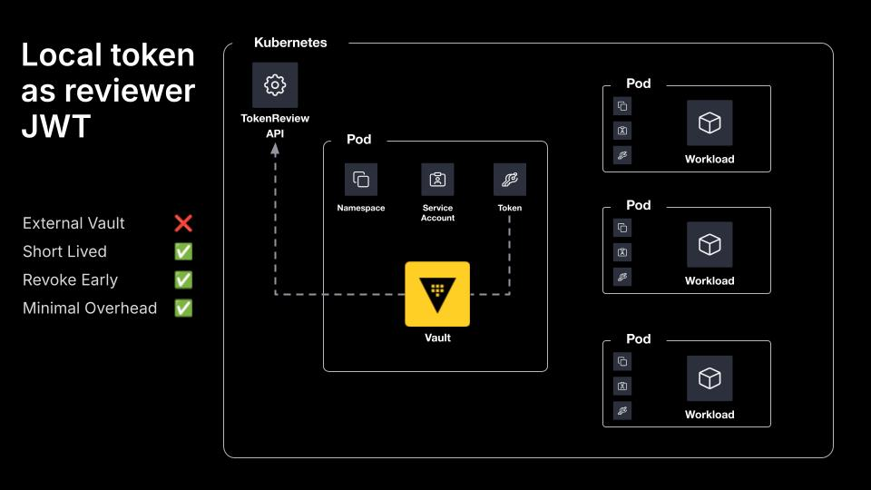

## Local Token as Reviewer JWT

When running Vault in a Kubernetes pod the recommended option is to use the pod's local service account token. Vault will periodically re-read the file to support short-lived tokens. To use the local token and CA certificate, omit `token_reviewer_jwt` and `kubernetes_ca_cert` when configuring the auth method.

## Diagram


## Demo
Everything in this demo is done locally, so there are a few requirements you need to have installed on your machine:
- [Terraform](https://www.terraform.io/downloads.html)
- [Docker](https://www.docker.com/get-started)
- [Kind](https://kind.sigs.k8s.io/docs/user/quick-start#installation)
- [Kubectl](https://kubernetes.io/docs/tasks/tools/)

### Usage
```shell
$ terraform apply

$ kubectl get namespaces
$ kubectl get -n vault pods 
$ kubectl get -n workloads pods
$ kubectl logs -n workloads app

$ terraform destroy
```

## Documentation
- https://developer.hashicorp.com/vault/docs/auth/kubernetes
