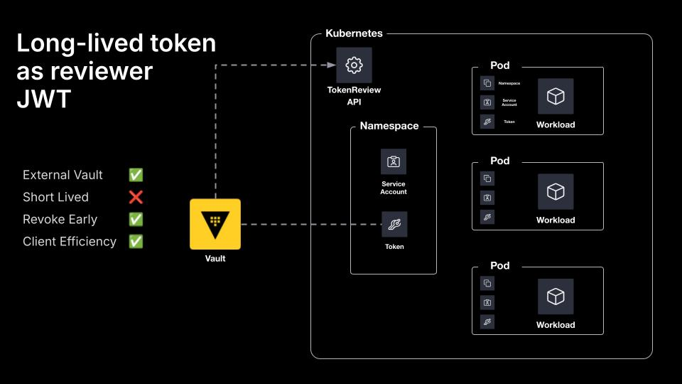

## Long-lived Token as Reviewer JWT

You can create a long-lived Kubernetes secret and use that as the `token_reviewer_jwt`. In this example, the vault service account would need the `system:auth-delegator` ClusterRole. Vault operators can manually rotate this token as needed. Using this configuration option maintains previous workflows but does not benefit from the improved security posture of short-lived tokens.

## Diagram


## Demo
Everything in this demo is done locally, so there are a few requirements you need to have installed on your machine:
- [Terraform](https://www.terraform.io/downloads.html)
- [Docker](https://www.docker.com/get-started)
- [Kind](https://kind.sigs.k8s.io/docs/user/quick-start#installation)
- [Kubectl](https://kubernetes.io/docs/tasks/tools/)

### Usage
```shell
$ terraform apply

$ docker ps
$ kubectl get namespaces
$ kubectl get -n workloads pods
$ kubectl logs -n workloads app

$ terraform destroy
```

## Documentation
- https://developer.hashicorp.com/vault/docs/auth/kubernetes
