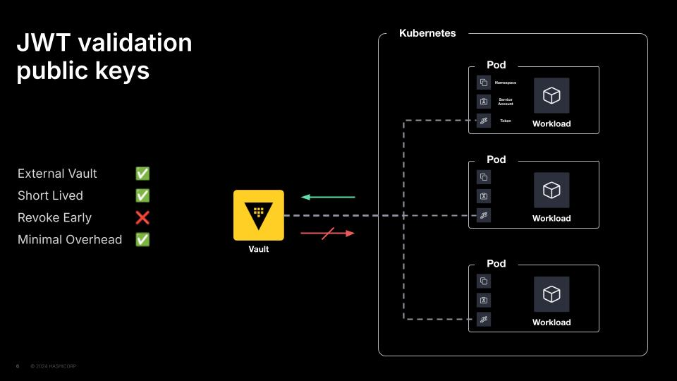

## JWT Validation Public Keys

This method can be useful if Kubernetes' API is not reachable from Vault or if you would like a single JWT auth mount to service multiple Kubernetes clusters by chaining their public signing keys.

> **Rotation of the JWT Signing Key in Kubernetes**  
> Should the JWT Signing Key used by Kubernetes be rotated, this process should be repeated with the new key.

## Diagram


## Demo
Everything in this demo is done locally, so there are a few requirements you need to have installed on your machine:
- [Terraform](https://www.terraform.io/downloads.html)
- [Docker](https://www.docker.com/get-started)
- [Kind](https://kind.sigs.k8s.io/docs/user/quick-start#installation)
- [Kubectl](https://kubernetes.io/docs/tasks/tools/)
- [JQ](https://jqlang.org/download/)

### Usage
```shell
$ terraform apply

$ docker ps
$ kubectl get namespaces
$ kubectl get -n workloads pods
$ kubectl logs -n workloads app

$ terraform destroy
```

## Documentation
- https://developer.hashicorp.com/vault/docs/auth/jwt/oidc-providers/kubernetes
